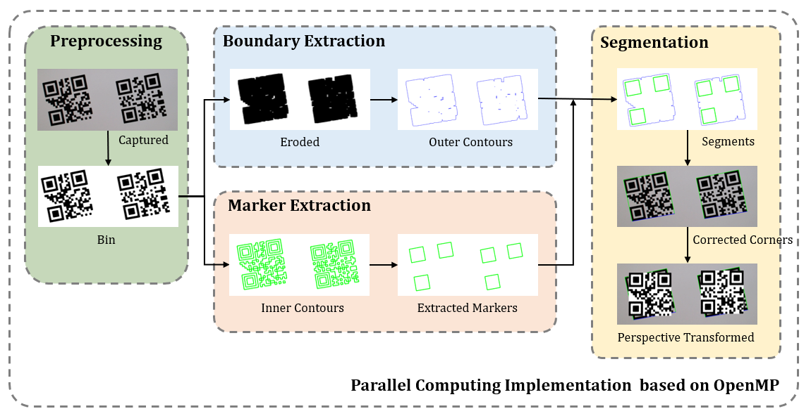

# Multiple QR codes Detection, Segmentation, and Decoding

* A real-time multiple QR codes decorder based on C++, openCV, and openMP

[](https://youtu.be/atH0RJN-ODs?t=0s) 
<br>

* Youtube #1 https://youtu.be/atH0RJN-ODs
* Youtube #2 https://youtu.be/QyaFEmmOGdk
<br>

## Features

### Works
* Detect all QR codes presented on a frame at the same time
* Segment the detected QR codes
* Decord them with openCV function (But, OpenCV Decoder shows poor performance...)

### Outputs
* The images of segmented QR codes (mode1: not-aligned, mode2: aligned)
* The positions
* The decorded informations

### limitation
* QR Code model1, model2 only

### Environments
* Windows 10
* C/C++, Visual Studio 2019
* openCV 4.1.1
* openMP for Parallel Computing
* Tested on image resolution 1920x1080

## How to Run
1. Download OpenCV 4.1.1(https://sourceforge.net/projects/opencvlibrary/files/4.1.1/opencv-4.1.1-vc14_vc15.exe/download)
2. Decompress it on the path "C:\"
3. Clone this project
4. Open the project file and complie it
5. Run it with release mode (Debug mode is slow)

<br>

## Methodology

1.

## Experiments
* Webcam Logitech C920 PRO HD WEBCAM

## Citation

```
@misc{openQR,
author = {Ye-Chan Choi},
title = {Multiple QR codes Detection, Segmenation, and Decoding},
publisher = {GitHub},
journal = {GitHub repository},
howpublished = {\url{https://github.com/clchan000/Multiple-QR-codes-Detection-Segmenation-and-Decoding}}
```


